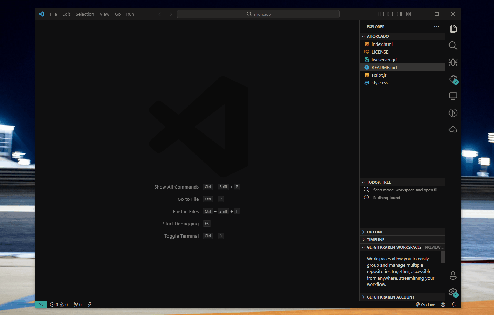

El Juego del Ahorcado hecho por: Sidney Silva Braz de Oliveira 2º DAW.

## Descripción General del Proyecto

Este es un pequeño proyecto hecho en JavaScript Vanilla en el que se desarrolla el famoso juego "El Ahorcado". 

El propósito de este proyecto es practicar todo lo que hemos aprendido sobre JavaScript durante todo este primer trimestre y hacer un juego en el cuál podremos competir con nuestros amigos.

## Instalación

Para realizar la instalación, **lo primero que tendremos que hacer** será clonar este repositorio:

```git
git clone https://github.com/sxdny/ahorcado.git
```

Una vez clonado, abrimeros el archivo `.html` con nuestro navegador o editor de código favorito.



## Funcionalidad

Las principales características del programa son las siguiente:
- Habilidad de escoger distintos tipos de palabras (por tópico).
- Almacenamiento de los datos varios usuarios. Algunos datos que se guardan son: nombre, partidas jugadas, tiempo total, etc.
- Varios tipos de palabras para adivinar


